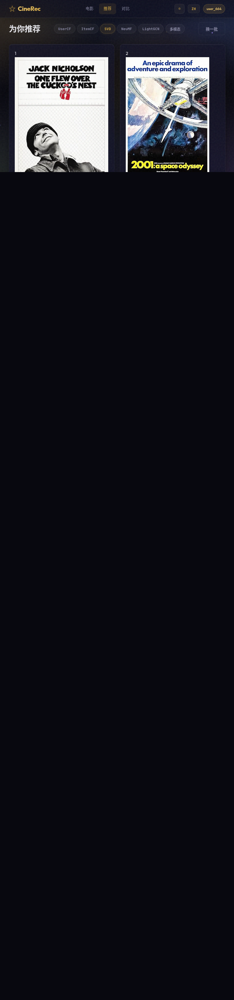
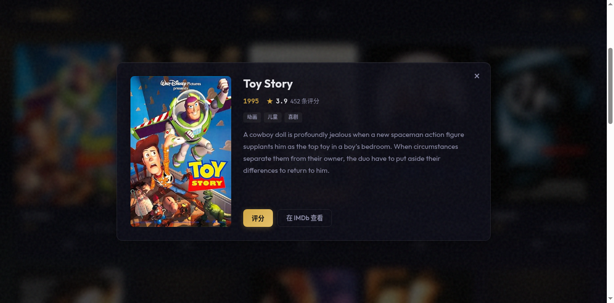
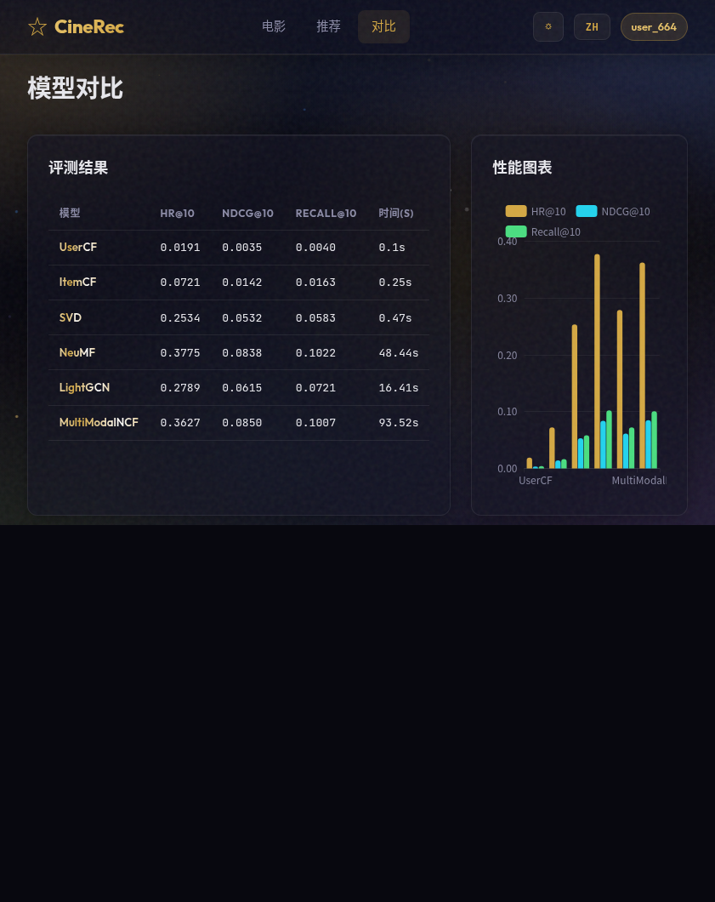
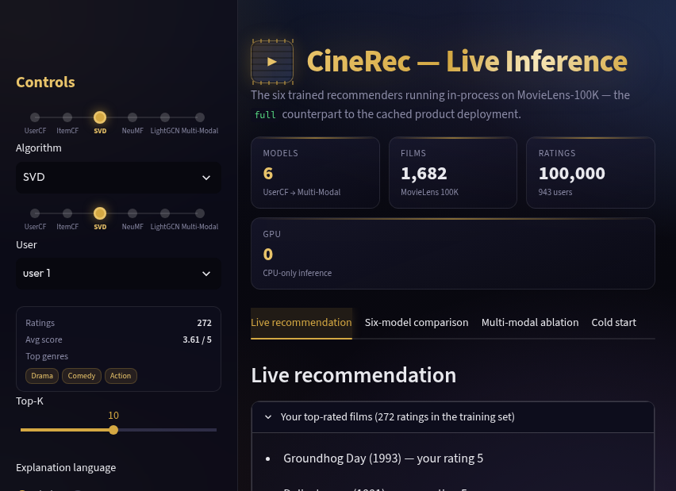
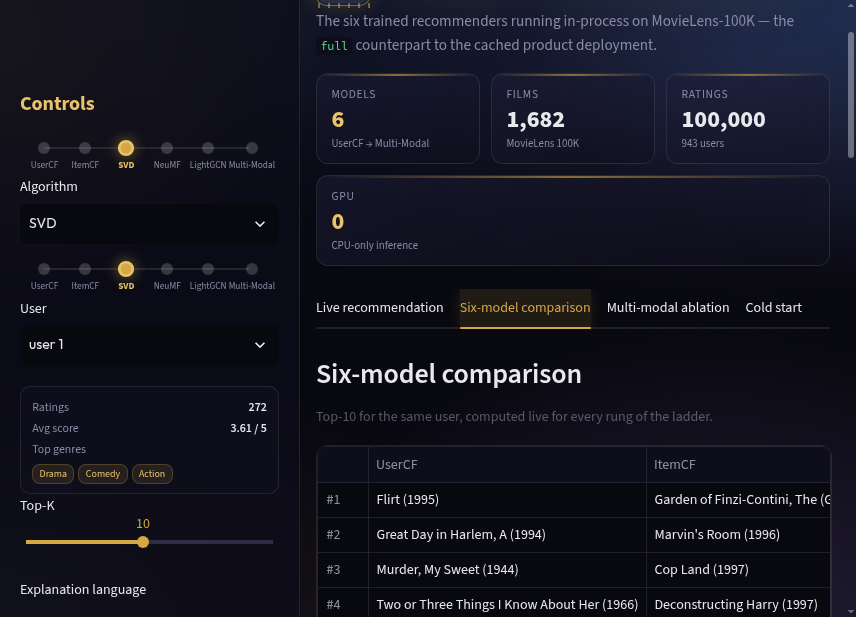
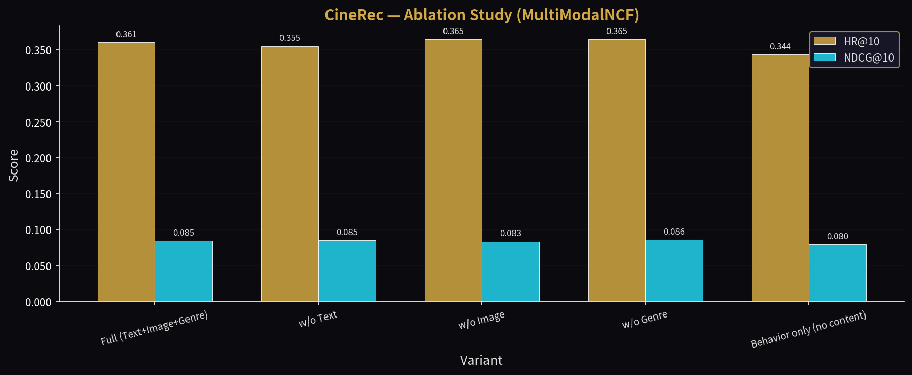
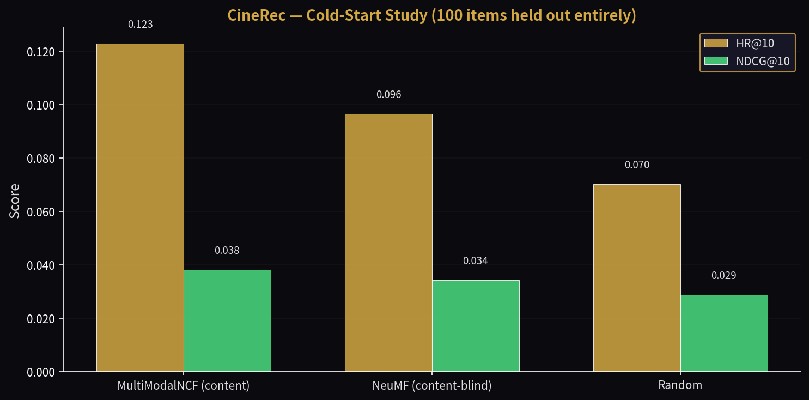
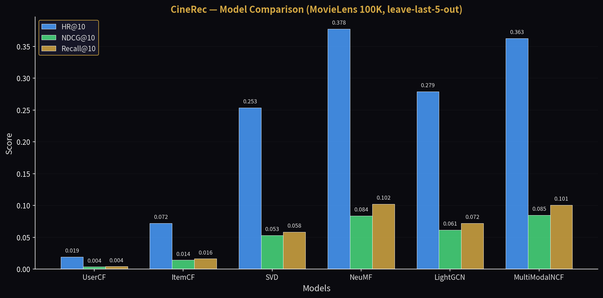
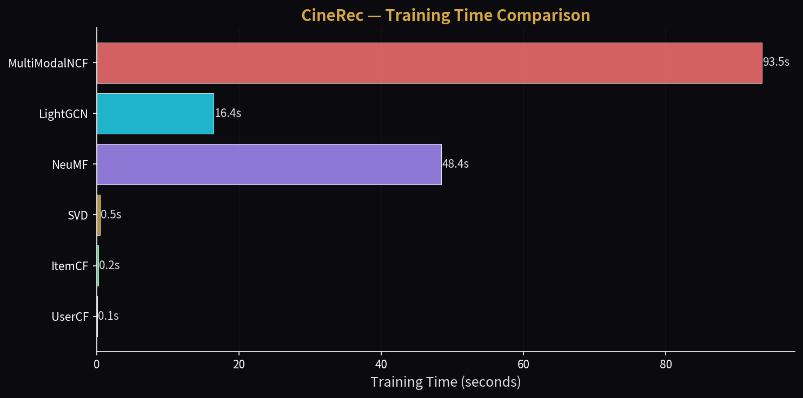

<div align="center">


<br><br>

# 🎬 CineRec

**Multi-Modal Movie Recommendation System**

*Six recommenders on one codebase — from UserCF to a multi-modal NCF — evaluated on
a single leave-last-5-out split whose numbers are reported as measured.*

[中文文档](#-项目简介) · [Live Demo](#-live-demo--在线演示) · [Demo](#-demo-preview--效果预览) · [Quick Start](#-quick-start--快速开始)

</div>

---

## 🔗 Live Demo / 在线演示

One codebase, two runtime modes (`APP_MODE`), each hosted on the free tier it fits
([ADR 0001](docs/adr/0001-dual-mode-deployment.md)):

| Mode | What it shows | Link |
|------|---------------|------|
| **`lite`** — product | The bilingual FastAPI web app. Recommendations come from a precomputed cache, so it fits a 512 MB instance. No account needed: click **游客体验 / Try as Guest**. | **https://cinerec-rfew.onrender.com** |
| **`full`** — companion | A Streamlit app that loads the trained PyTorch models and runs them **live**: live inference, the six-model comparison, the modality ablation, the cold-start study. | **https://cinerec-movie-recommend.streamlit.app** |

> Both run on free tiers and sleep when idle — the first visit can take a few
> seconds to wake. The companion lives in [`deploy/streamlit/`](deploy/streamlit/).

---

## 📋 Table of Contents

- [Live Demo / 在线演示](#-live-demo--在线演示)
- [Project Introduction / 项目简介](#-project-introduction--项目简介)
- [Key Features / 核心亮点](#-key-features--核心亮点)
- [Demo Preview / 效果预览](#-demo-preview--效果预览)
- [Architecture / 系统架构](#-architecture--系统架构)
- [Algorithms / 算法说明](#-algorithms--算法说明)
- [Evaluation / 评测结果](#-evaluation--评测结果)
- [Quick Start / 快速开始](#-quick-start--快速开始)
- [Tech Stack / 技术栈](#-tech-stack--技术栈)
- [Project Structure / 项目结构](#-project-structure--项目结构)
- [FAQ / 常见问题](#-faq--常见问题)
- [License](#-license)
- [Changelog / 更新日志](#-changelog--更新日志)

---

## 📖 Project Introduction / 项目简介

CineRec is a full-stack movie recommender that implements six models in ascending
order of complexity and scores all of them against the same candidate set. It ships
a bilingual dark-cinema web frontend, a REST API, and a Docker build that serves
either runtime mode from the same image.

CineRec 是一个全栈电影推荐系统，实现了 6 个复杂度递进的模型，并在同一候选集上统一
评测。它包含双语暗色 Web 前端、REST API，以及可用同一镜像服务两种运行模式的 Docker 构建。

> 💡 **"Don't just use models — understand them."**
> 不要只是用模型，要理解它们。CineRec 的每一层算法都展示了推荐系统从传统到前沿的演进路径。

---

## ✨ Key Features / 核心亮点

- **6 个模型，一个真相源** — UserCF → ItemCF → SVD → NeuMF → LightGCN → Multi-Modal NCF。算法集合与加载方式集中在 [`models/registry.py`](models/registry.py)，前端、API、预计算脚本都从这里取。
- **多模态融合（核心创新）** — Multi-Modal NCF 在 MLP 路径上用 Content Tower 融合 Sentence-BERT 文本(384d)、ResNet-50 图像(2048d) 与类型(18d) 特征。
- **诚实的离线评测** — 单一 leave-last-5-out 划分，候选集剔除训练已见条目，6 个模型共用同一套 HR@K / NDCG@K / Recall@K。正文明确标注 single-seed，不作"最优模型"声明。
- **可解释 · 双语 · 双模式** — 每条推荐给出理由；EN/ZH 前端；`lite`（预计算缓存）与 `full`（实时推理）同仓切换。
- **可观测** — 推理 LRU 缓存、`/api/metrics` 进程内延迟/吞吐、实测 Locust 压测 → [`reports/loadtest.md`](reports/loadtest.md)。
- **电影详情弹窗** — 点击任意电影卡片（或键盘 Enter）打开无障碍详情弹窗：海报、简介、类型、平均评分、评分入口与 IMDb 链接；Escape/关闭按钮/遮罩点击关闭；随语言切换重绘。
- **Streamlit 美化伴生应用** — 胶片 logo + KPI 条 + 融合推荐卡 + CSS 柱状图/热力图 + 算法阶梯 + 用户画像，纯 CSS 图表不增加依赖。

---

## 🖼 Demo Preview / 效果预览

### Recommendation Engine / 推荐引擎
> Real-time personalized recommendations with algorithm switching and explainable reasons.



### Movie Library / 电影库
> Browse 1,682 movies with real posters, search, genre filtering, and pagination. Click any card to open a detail popup with synopsis, rating, and IMDb link.


### Movie Detail Modal / 电影详情弹窗
> Click any movie card (or press Enter on a focused card) to open an accessible detail popup — poster, synopsis, genres, average rating, and actions to rate or view on IMDb. Closes with Escape, close button, or backdrop click; re-renders on language switch.



### Evaluation Dashboard / 评测看板
> Interactive model comparison with real leave-last-5-out evaluation metrics — all six models side by side.



### Streamlit Companion (Full Mode) / Streamlit 伴生应用
> Live inference companion with a film-strip logo, KPI strip, CSS bar charts, a Jaccard overlap heatmap, an algorithm ladder, and a user profile mini-card.

<table>
<tr>
<td></td>
<td></td>
</tr>
<tr>
<td align="center"><sub>Live recommendation + KPI strip</sub></td>
<td align="center"><sub>Six-model comparison + heatmap</sub></td>
</tr>
</table>

---

## 🏗 Architecture / 系统架构

```
┌───────────────────────────────────────────────────────────────┐
│                        User Browser                          │
│     Dark/Light Theme · GSAP Animations · ECharts · i18n       │
├───────────────────────────────────────────────────────────────┤
│                     FastAPI REST API                          │
│                                                              │
│   /api/auth ───── /api/movies ───── /api/recommend           │
│        │              │                  │                   │
│        │              │         ┌────────┴────────┐           │
│        │              │         │  Algorithm Switch │           │
│        │              │         └────────┬────────┘           │
├────────┼──────────────┼──────────────────┼───────────────────┤
│        │       ┌──────┴──────┐    ┌───────┴───────┐          │
│  Auth Service   Movie Service  Recommend Service            │
│  (demo login)   (CRUD + posters) (6 Models + Explainer)       │
│        │              │                  │                   │
├────────┼──────────────┼──────────────────┼───────────────────┤
│        │       ┌──────┴──────────────────┴───────┐           │
│        │       │      Model Layer (6 Models)      │           │
│        │       │                                   │           │
│        │       │  ┌─────────┐  ┌─────────┐        │           │
│        │       │  │  UserCF  │  │  ItemCF  │        │           │
│        │       │  │ (Pearson)│  │(Adj Cos)│        │           │
│        │       │  └─────────┘  └─────────┘        │           │
│        │       │  ┌─────────┐  ┌─────────┐        │           │
│        │       │  │   SVD    │  │  NeuMF   │        │           │
│        │       │  │(SVD,k=64)│  │(GMF+MLP) │        │           │
│        │       │  └─────────┘  └─────────┘        │           │
│        │       │  ┌───────────────────────┐      │           │
│        │       │  │       LightGCN         │      │           │
│        │       │  │  Graph Convolution (BPR)│      │           │
│        │       │  └───────────────────────┘      │           │
│        │       │  ┌───────────────────────┐      │           │
│        │       │  │   Multi-Modal NCF ⭐   │      │           │
│        │       │  │ Text+Image+Genre Fusion│      │           │
│        │       │  └───────────────────────┘      │           │
│        │       └──────────────────────────────────┘           │
├────────┼─────────────────────────────────────────────────────┤
│        │       Feature Engineering (Pre-computed)            │
│  ┌─────┴─────┐  ┌──────────────┐  ┌──────────────┐        │
│  │Sentence-BERT│  │  ResNet-50   │  │Genre Encoding│        │
│  │  Text 384d │  │  Image 2048d │  │  Multi-hot   │        │
│  └───────────┘  └──────────────┘  └──────────────┘        │
├─────────────────────────────────────────────────────────────┤
│               Data Layer (SQLite + MovieLens 100K)          │
│  100,000 ratings · 943 users · 1,682 movies · enriched metadata │
└─────────────────────────────────────────────────────────────┘
```

---

## 🧮 Algorithms / 算法说明

| Level | Model | Method | Description |
|:-----:|-------|--------|-------------|
| 1 | **UserCF** | Pearson Correlation | Find K similar users, aggregate their preferences. Vectorized computation. |
| 2 | **ItemCF** | Adjusted Cosine | Recommend items similar to user's rated history. Vectorized similarity. |
| 3 | **SVD** | Matrix Factorization | Decompose the user-item matrix into latent factors (k=64) via truncated SVD (`scipy.sparse.linalg.svds`). |
| 4 | **NeuMF** | GMF + MLP (PyTorch) | Dual-path architecture: element-wise product + deep MLP. BCE loss with negative sampling. |
| 5 | **LightGCN** | Graph Convolution (PyTorch) | Simplified GCN on the user–item bipartite graph: neighbourhood aggregation averaged over layers, trained with BPR. |
| 6 | **Multi-Modal NCF** ⭐ | Text+Image+Genre Fusion | Core innovation. Replaces item embedding in MLP path with a Content Tower fusing multi-modal features. |

### Multi-Modal NCF Architecture (Core Innovation / 核心创新)

```
                    ┌──────────────────┐
                    │   User Tower     │
                    │ user_id → Emb(64)│
                    └────────┬─────────┘
                             │
              ┌──────────────┼──────────────┐
              ▼              ▼              ▼
     ┌────────────┐  ┌──────────────┐
     │  GMF Path  │  │  MLP Path    │
     │ user⊙item  │  │              │
     │ (behavior) │  │  Content Tower (⭐)
     └─────┬──────┘  │  ┌────────────────────┐
           │         │  │ Text(384)→FC(64)    │
           │         │  │ Image(2048)→FC(64)   │
           │         │  │ Genre(18)→FC(64)    │
           │         │  │ Concat(192)→FC(64)  │
           │         │  └──────────┬─────────┘
           │         │             │
           │         │  Concat(user, content)
           │         │      FC(128→256→128→64)
           │         └──────┬──────┘
           │                │
           └─────── Concat(GMF, MLP) ──→ FC(128→1) ──→ Sigmoid ──→ Prediction
```

**Cold Start Support**: New items use `content_emb` only, GMF path uses zero vector.

---

## 📊 Evaluation / 评测结果

### Model Comparison on MovieLens 100K (leave-last-5-out)

Protocol: the 5 most recent interactions of each user are held out; every model is
scored against the same candidate set (all items minus the user's training items),
so re-recommending already-seen titles cannot inflate the numbers.

| Model | HR@10 | NDCG@10 | HR@20 | NDCG@20 | Train Time |
|:-----:|:-----:|:-------:|:-----:|:-------:|:-----------:|
| UserCF | 0.0191 | 0.0035 | 0.0477 | 0.0060 | 0.1s |
| ItemCF | 0.0721 | 0.0142 | 0.1283 | 0.0199 | 0.25s |
| SVD | 0.2534 | 0.0532 | 0.3542 | 0.0664 | 0.47s |
| NeuMF | **0.3775** | 0.0838 | **0.5164** | 0.1121 | 48.4s |
| LightGCN | 0.2789 | 0.0615 | 0.4210 | 0.0804 | 16.4s |
| **MultiModalNCF** ⭐ | 0.3627 | **0.0850** | 0.5133 | **0.1123** | 93.5s |

> **Honest reading**: on this single split the strongest hit-rate result is **NeuMF**
> (HR@10 0.3775 / HR@20 0.5164), while **MultiModalNCF** leads only on NDCG
> (0.0850 / 0.1123) — i.e. content features mainly improve the *ranking* of the
> items the model already retrieves. **LightGCN** lands between SVD and NeuMF at a
> fraction of NeuMF's training time. The neural models pay for their gains with a
> much longer training time, making the accuracy/cost trade-off explicit. These are
> single-seed numbers and the top gaps are small, so no "best model" claim is made.

### Key Findings / 关键发现

- **UserCF → ItemCF → SVD** shows the expected jump from neighbourhood heuristics to
  matrix factorization; SVD is the best accuracy-per-second point on the ladder.
- **NeuMF** leads HR@10 at 0.3775 / HR@20 at 0.5164 — learned non-linear interaction
  modelling beats plain factorization on this dataset once candidates are filtered
  to unseen items.
- **LightGCN** sits between SVD and NeuMF (HR@10 0.2789) with the best
  accuracy-per-second among the neural models — competitive with no content features.
- **MultiModalNCF** trails NeuMF on hit-rate while leading on NDCG (0.0850 / 0.1123):
  fusing Sentence-BERT text, ResNet-50 image and genre content mainly improves the
  *ranking* of the items it retrieves — the ablation study quantifies each modality.

### Ablation Study / 消融实验

Each row retrains MultiModalNCF on the same split with one content modality blanked
at the input, isolating its contribution.

| Variant | HR@10 | NDCG@10 | HR@20 | NDCG@20 |
|:--------|:-----:|:-------:|:-----:|:-------:|
| Full (Text+Image+Genre) | 0.3606 | 0.0846 | 0.5037 | 0.1110 |
| w/o Text | 0.3552 | 0.0849 | 0.5027 | 0.1120 |
| w/o Image | 0.3648 | 0.0834 | 0.4984 | 0.1096 |
| w/o Genre | 0.3648 | 0.0860 | 0.5080 | 0.1122 |
| **Behavior only (no content)** | 0.3436 | 0.0795 | 0.4825 | 0.1069 |

> **Honest reading**: dropping *all* content features (behavior only) consistently
> hurts every metric — content is doing real work. The single-modality deltas,
> however, fall within single-seed noise (this is one seed, not a significance
> test), so no per-modality ranking is claimed.



### Cold-Start Study / 冷启动实验

100 items are removed from training entirely, then ranked within the cold pool
(the content-aware task). MultiModalNCF scores them through the content tower —
no trained embedding — while NeuMF is the content-blind control.

| Model | HR@10 | NDCG@10 | HR@20 | NDCG@20 |
|:------|:-----:|:-------:|:-----:|:-------:|
| **MultiModalNCF (content)** ⭐ | **0.1228** | **0.0382** | **0.2719** | **0.0743** |
| NeuMF (content-blind) | 0.0965 | 0.0344 | 0.2193 | 0.0630 |
| Random | 0.0702 | 0.0288 | 0.2018 | 0.0610 |

> Content-aware scoring beats the content-blind model, which in turn beats the
> random floor — the multi-modal tower genuinely transfers to items with no
> collaborative history. Single-seed study on MovieLens 100K; no significance claims.



### Charts from Measured Results / 实测图表




---

## 🚀 Quick Start / 快速开始

> **Zero-training start**: the trained models, content features and a MovieLens
> seed ship in the repo (see [ADR 0002](docs/adr/0002-artifact-storage.md)), and the
> database is seeded on first boot — so a fresh clone serves real recommendations
> without downloading or training anything.

### Docker (Recommended / 推荐)

```bash
git clone https://github.com/ElijahZhao/cinerec.git
cd cinerec
docker compose up --build        # APP_MODE=full by default
# Visit http://localhost:8000
```

### Local / 本地

```bash
git clone https://github.com/ElijahZhao/cinerec.git
cd cinerec
make setup && make serve         # runtime deps only, no torch
# Visit http://localhost:8000
```

`APP_MODE=lite make serve` skips torch entirely and serves the precomputed
`recs_cache.json` — that is the mode used on the always-on free tier.

<details>
<summary><b>Reproduce from scratch / 一键复现（可选）</b></summary>

```bash
make setup-train                 # torch + vision stack
make data                        # MovieLens 100K + enriched metadata
make features                    # Sentence-BERT + ResNet-50 content features
make train && make eval          # train all 6 models → eval_results.json
make ablation && make coldstart  # modality ablation + cold-start study
make charts                      # regenerate docs/*.png from measured results
make test                        # pytest suite
```
</details>

---

## 🔧 Tech Stack / 技术栈

| Layer | Technologies |
|-------|-------------|
| **ML Models** | PyTorch, scikit-learn, `scipy.sparse.linalg`, Sentence-BERT, ResNet-50 |
| **Backend** | Python, FastAPI, SQLite, Uvicorn |
| **Frontend** | Vanilla JS (SPA), GSAP 3, Lenis, Canvas star field, ECharts |
| **Data** | MovieLens 100K + enriched metadata (plot summaries & posters) |
| **Deployment** | Docker / docker-compose · Render free tier (`lite`) · Streamlit Community Cloud (`full`) |
| **Quality** | ruff, black, pytest + coverage, pre-commit, GitHub Actions CI |

---

## 📁 Project Structure / 项目结构

```
cinerec/
├── api/                  # FastAPI REST endpoints
│   ├── main.py           # App entry, CORS, static files, /api/health, /api/metrics
│   ├── auth.py           # Session auth (PBKDF2 + signed demo tokens)
│   ├── movies.py         # Movie browsing, search, filtering
│   ├── recommend.py      # Model inference + explanation (APP_MODE aware, LRU cache)
│   ├── metrics.py        # In-process request counters + latency middleware
│   └── eval_api.py       # Evaluation results API
├── models/                # 6 recommender models
│   ├── base.py           # Base recommender class
│   ├── registry.py       # Single source of truth for the algorithm ladder
│   ├── user_cf.py        # User-based CF (Pearson)
│   ├── item_cf.py        # Item-based CF (Adjusted Cosine)
│   ├── svd_als.py        # SVD via truncated SVD (scipy; despite the name, not ALS)
│   ├── neumf.py          # Neural MF (GMF + MLP)
│   ├── lightgcn.py       # LightGCN graph convolution (BPR)
│   ├── multimodal_ncf.py # Multi-Modal NCF ⭐ (Core Innovation)
│   └── explain.py        # RecommenderExplainer (XAI)
├── evaluation/            # Offline evaluation framework
│   ├── metrics.py         # HR@K, NDCG@K, Recall@K
│   ├── runner.py          # leave-last-5-out evaluation runner
│   └── visualize.py       # chart generation from measured results
├── data/                  # Data pipeline
│   ├── download.py        # MovieLens 100K download
│   ├── preprocess.py      # Sentence-BERT / ResNet-50 feature engineering
│   ├── enrich_tmdb.py     # TMDB poster/plot enrichment
│   └── processed/         # Committed models, features and results
├── db/                    # SQLite layer (idempotent schema + first-boot seed)
├── frontend/              # Web UI
│   ├── index.html         # SPA shell
│   ├── css/               # Dark/Light theme styles
│   ├── js/                # App logic, animations, effects
│   └── assets/i18n/       # EN/ZH translations
├── scripts/               # precompute, ablation, cold-start, train_all, locustfile
├── tests/                 # pytest suite
├── deploy/                # Streamlit companion (own deps) + notes
│   └── hf-space/          # Record of the rejected HF Spaces option (see ADR 0001)
├── docs/adr/              # Architecture decision records
├── reports/               # Measured load-test report + Locust HTML output
├── config.py              # Paths, APP_MODE, cache switches
├── Dockerfile
├── docker-compose.yml
├── render.yaml
├── Makefile
├── requirements.txt / requirements-train.txt
├── streamlit_app.py       # live-inference companion (entry: deploy/streamlit/)
└── README.md
```

---

## ❓ FAQ / 常见问题

<details>
<summary><b>为什么有 lite 和 full 两种模式？</b></summary>

`full` 需要 torch 并实时推理；`lite` 用预计算的 `recs_cache.json` 换取极小内存占用，
以便在 512 MB 免费实例上常驻。两者是同一代码库，由 `APP_MODE` 切换。详见
[ADR 0001](docs/adr/0001-dual-mode-deployment.md)。
</details>

<details>
<summary><b>新注册用户的推荐为什么是热门榜？</b></summary>

预计算缓存只覆盖已有用户；新用户不在缓存内，接口会回退到热门推荐并**显式标注**，
而不是报错。见 ADR 0001 的 "Consequences"。
</details>

<details>
<summary><b>评测为什么只有 single split / single seed？</b></summary>

这是刻意的取舍：项目目标是展示算法取舍与工程规范，而非追 SOTA。正文所有结论均标注
single-seed、不作显著性声明。如需多 seed，可改 `evaluation/runner.py` 重跑。
</details>

<details>
<summary><b>SVD 用的是 ALS 吗？</b></summary>

不是。文件名 `models/svd_als.py` 是历史命名，实现是 truncated SVD
（`scipy.sparse.linalg.svds`），[ADR 0003](docs/adr/0003-algorithm-ladder.md) 已说明。
</details>

<details>
<summary><b>如何用 Docker 跑 lite 模式？</b></summary>

```bash
docker build --build-arg APP_MODE=lite -t cinerec:lite .
docker run -p 8000:8000 cinerec:lite
```
健康检查：`GET /api/health`；进程指标：`GET /api/metrics`。
</details>

<details>
<summary><b>为什么数据集里的电影都这么老？/ Why are all the movies so old?</b></summary>

**中文** — 因为数据集是 **MovieLens 100K**，它是在 **1997-09-19 到 1998-04-22** 这七个月里
从 MovieLens 网站收集的，片目覆盖 **1922–1998**，所以片库里最新的电影就是 1998 年的——
这是**原始数据的年代范围**，不是我们的数据管道出问题。

选它是一次明确的取舍：它只有 100,000 条评分（943 用户 × 1,682 部电影，每人都至少评过 20 部），
六模型全部可在 CPU 上秒级到分钟级训练完，因此我们能把"精度 vs 训练耗时"的真实权衡讲清楚，
并把训练好的模型与特征直接入库，让一个新克隆**零训练**即可跑起来（见 [ADR 0002](docs/adr/0002-artifact-storage.md)）。
它同时是学术界通行、可引用的基准，便于把 HR@K / NDCG@K 与文献对照。
完整的取舍与被否决的选项见 [ADR 0004](docs/adr/0004-dataset-choice.md)。

**English** — Because the dataset is **MovieLens 100K**, collected through the
MovieLens website over the seven months from **19 Sep 1997 to 22 Apr 1998**; its
catalogue spans **1922–1998**, so a 1998 title is the *end of the range*, not a
stale mirror. That is a property of the source data, not a pipeline bug.

It was a deliberate trade-off: only 100,000 ratings (943 users × 1,682 movies,
each user with ≥ 20 ratings) means all six models train in seconds-to-minutes on
CPU, which lets us report an honest accuracy/cost trade-off and commit the trained
artefacts so a fresh clone serves recommendations with **zero training**
([ADR 0002](docs/adr/0002-artifact-storage.md)). It is also the standard, citable
benchmark, so our numbers can be compared against the literature. Full reasoning
and the rejected alternatives are in [ADR 0004](docs/adr/0004-dataset-choice.md).
</details>

<details>
<summary><b>数据从哪里来？商用 / 再分发的许可如何？/ Where does the data come from, and what about commercial use & redistribution?</b></summary>

**中文** — 三份材料，三套许可，互不覆盖：

1. **本项目代码** —— MIT（见 [LICENSE](LICENSE)）。
2. **MovieLens 100K 评分数据** —— 由明尼苏达大学 GroupLens Research Project 提供，**仅供研究/非商业**用途：
   未经许可**不得再分发**，**不得用于任何商业或盈利目的**，且不得暗示获得明尼苏达大学的背书。
   本项目是**非商业的个人作品集项目**，正是按此条件使用。若在出版物中使用，请引用
   Harper & Konstan (2015), *The MovieLens Datasets: History and Context*, ACM TiiS 5(4)。
   原始数据经 [`data/download.py`](data/download.py) 从 `files.grouplens.org` 获取（https-only + 白名单）。
3. **海报与剧情简介（元数据）** —— 通过 TMDB API 获取（[`data/enrich_tmdb.py`](data/enrich_tmdb.py)），
   受 TMDB 条款约束；1,682 部中有 1,400 部有简介、1,366 部有海报，未匹配的会优雅降级。

**English** — Three inputs, three licences, none of which covers the others:

1. **This project's code** — MIT (see [LICENSE](LICENSE)).
2. **The MovieLens 100K ratings** — provided by the GroupLens Research Project,
   University of Minnesota, for **research / non-commercial** use: it must **not be
   redistributed** without permission and must **not** be used for commercial or
   revenue-bearing purposes, and no endorsement by the University of Minnesota may
   be implied. This repository is a **non-commercial portfolio project** and uses it
   on exactly those terms. Publications must cite Harper & Konstan (2015),
   *The MovieLens Datasets: History and Context*, ACM TiiS 5(4). The raw data is
   fetched by [`data/download.py`](data/download.py) from `files.grouplens.org`
   (https-only, allow-listed host).
3. **Poster and overview metadata** — fetched from the TMDB API
   ([`data/enrich_tmdb.py`](data/enrich_tmdb.py)) and subject to TMDB's terms;
   1,400 / 1,682 rows have an overview and 1,366 / 1,682 a poster, and unmatched
   titles degrade gracefully.
</details>

---

## 📄 License

The **source code** is licensed under the MIT License — see [LICENSE](LICENSE).

This does **not** extend to the bundled data:

- **MovieLens 100K** (ratings, titles, genres, years) is © GroupLens Research,
  University of Minnesota, provided for **non-commercial research use**. It may
  not be redistributed or used commercially without permission. See the
  [FAQ entry above](#-faq--常见问题) and [ADR 0004](docs/adr/0004-dataset-choice.md).
- **Poster and overview metadata** are fetched from the TMDB API
  ([`data/enrich_tmdb.py`](data/enrich_tmdb.py)); TMDB's terms apply.

---

## 📝 Changelog / 更新日志

<details>
<summary>展开查看</summary>

- **2026-10-05** — UI：电影详情弹窗（卡片点击/键盘打开、评分与 IMDb 入口、随语言切换重绘）；数据集取舍与许可写入 [ADR 0004](docs/adr/0004-dataset-choice.md) 与上方 FAQ；Streamlit 伴生应用美化（胶片 logo + KPI 条 + 融合推荐卡 + CSS 柱状图/热力图 + 算法阶梯 + 用户画像）；README 截图全部更新为最新版本。
- **2026-10-05** — UI：动画背景 + canvas 星空 + 字体改版；Streamlit 伴生应用独立目录与主题。
- **2026-10-05** — 部署：Render(`lite`) + Streamlit(`full`) 双档免费部署定稿（ADR 0001）。
- **2026-10-04** — 评测：6 模型统一评测 + 消融 + 冷启动实验；MLOps：LRU 缓存 + `/api/metrics` + Locust 压测。
- **2026-07-19** — 初始版本：UserCF / ItemCF / SVD / NeuMF + 前端 + 数据库。

> 详细过程记录见 [`docs/ROADMAP.md`](docs/ROADMAP.md)。
</details>

---

<div align="center">

**Built with ❤️ by an AI undergraduate student**

*Classic CF → Matrix Factorization → Neural CF → Multi-Modal CF*

</div>